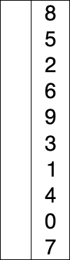
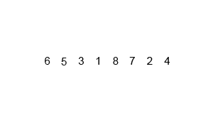

# Task 1 - Какие бывают алгоритмы сортировок?

### Пузырьковая сортировка и алгоритмы на ее основе

- **Пузырьковая сортировка** - значения соседних элементов сравниваются последовательно и меняются местами в случае, если предыдущее значение оказывается больше последующего. Данный алгоритм медленный и на практике почти не используется, но на его основе построены другие методы (напр., шейкерная сортировка и сортировка расчетской).

- **Сортировка перемещением (шейкерная сортировка)** - двунаправленная сортировка, сначала алгоритм проходится слева направа, а затем справа налево.

- **Сортировка расчеткой** - берется достаточно большое расстояние между сравниваемыми значениями (это расстояние берется с учетом специальной величины - фактора уменьшения, оптимальное значение которого равно 1,247), а затем оно уменьшается вплоть до минимального. Сначала расстояние между элементами будет равнятся размеру массива, поделенному на фактор уменьшения. На каждом последующем шаге расстояние будет снова делиться на фактор уменьшения.

### Простые сортировки

- **Сортировка вставками** - массив постепенно перебирается слева направо, при этом каждый последующий элемент размещается так, чтобы он оказался между ближайшими элементами с минимальным и максимальным значением. 

- **Сортировка выбором** - в подмножестве массива находится минимальный (или максимальный) элемент и меняется местами со значением первого неотсортированного элемента.

### Эффективные сортировки

- **Быстрая сортировка** - состоит из 3-х шагов:
  + Из массива выбирается один опорный элемент
  + Другие элементы распределяются так, чтобы элементы меньше опорного оказались слева, а те, которые больше, - справа
  + Затем рекурсивно применяют два первых шага к подмассивам справа и слева от опорного

- **Сортировка слиянием** - массив делится на две примерно равные части и они сортируются рекурсивно. После сортировки двух частей массива к ним применяется процедура слияния, которая по двум отсортированным частям получает исходный отсортированный массив.

- **Пирамидальная сортировка** - сначала строится пирамида из элементов исходного массива. Пирамида (или двоичная куча) — это способ представления элементов, при котором от каждого узла может отходить не больше двух ответвлений. А значение в родительском узле должно быть больше значений в его двух дочерних узлах.Пирамидальная сортировка похожа на сортировку выбором, где мы сначала ищем максимальный элемент, а затем помещаем его в конец. Дальше нужно рекурсивно повторять ту же операцию для оставшихся элементов.

