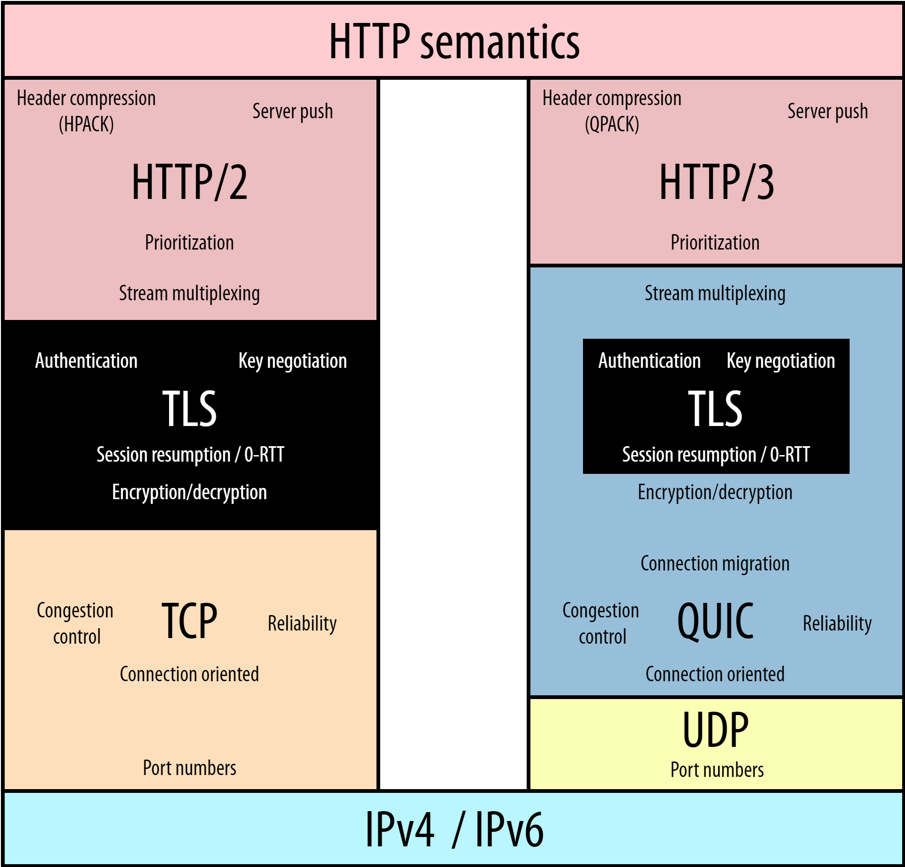

# Task 2 - HTTP/3

Ключевая особенность протокола HTTP/3 наглядно видна на схеме, показывающий стеки протоколов HTTP/2 и HTTP/3 - появление нового транспортного простокола QUIC:

QUIC - транспортный протокол, разработанный Google, который пришел на смену TCP. Уже по названию (Quick UDP Internet Connections) понятно, что построен он на основе протокола UDP.

Особенности: 
- В QUIC уже встроено TLC шифрование (причем как в заголовках, так и в полезной нагрузке пакета)

- QUIC позволяет избавиться от Head-of-Line Blocking на уровне транспортного протокола (проблема была решена в HTTP/2, но на уровне HTTP, на уровне TCP проблема оставалась). QUIC делает передачу нескольких потоков байтов основой транспортного уровня и обрабатывает потерю покетов для каждого потока по отдельности.

- QUIC поддерживает миграцию соединений. При переключении с Wi-Fi на LTE TCP соединение будет тратить время на переподключение (установка новых рукопожатий - handshake). QUIC добавляет новую концепцию - идентификатор соединения (Connetcion ID), что позволяет не разрывать соединение.

- В целом уменьшение количества handshaking (за счет реализации TLS на своем уровне). При первом соединении будет произведено 3 рукопожатия, но при повторном - соединение будет проходит за 0-RTT (RTT - Round Trip Time - время, которое требуется для отправки пакета данных в пункт назначения, плюс время, которое требуется для подтверждения того, что этот пакет был получен обратно)

- В отличии от TCP QUIC легко развивать.

> #### Полезные материалы
> - [HTTP/3 от А до Я: основные концепции. Часть 1](https://habr.com/ru/companies/slurm/articles/575464/)
> - [HTTP/1 to HTTP/2 to HTTP/3](https://www.youtube.com/watch?v=a-sBfyiXysI)
> - [Андрей Чупин — Ускоряем сетевой слой ВКонтакте с HTTP/3](https://www.youtube.com/watch?v=tnj-Wx9WLVY)
> - [Александр Зубов - HTTP/3… а уже можно?*](https://www.youtube.com/watch?v=T_4xgLUJFF0)
